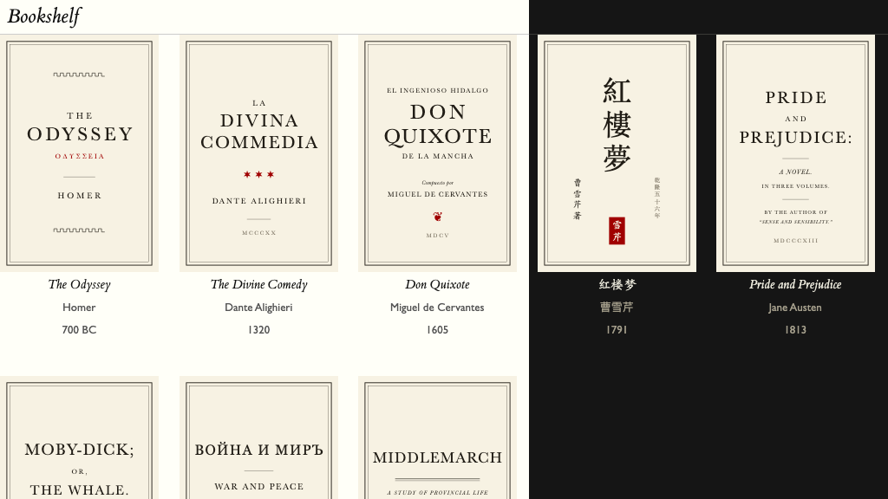

# Tufte for Obsidian

   

**English** | [简体中文](README.zh.md)

An [Obsidian](https://obsidian.md) theme adapted from [Tufte CSS](https://edwardtufte.github.io/tufte-css/), carrying Edward Tufte's book design — ET Book type, marginalia, restrained rules, one deliberate red — into every corner of the app, with a full Chinese typographic system (宋体正文、楷体示例、黑体数据) alongside the Latin one.

## What the theme covers

- **Typography** — ET Book (embedded, offline; MIT-licensed) with Palatino/Georgia fallbacks; Gill Sans for data, chrome, and (since 1.17.0) the whole interface; a 55rem reading measure with a marginalia gutter; lining tabular figures wherever digits stack. **Every face and weight is a knob**: serif, sans and the Chinese companions — Source Han presets, the bundled Cabin, or any installed font — are chosen from Tufte Suite's Typefaces settings.
- **Tables and Bases** — prose tables and Obsidian's Bases database views share one specimen-table register modeled on *Beautiful Evidence*: a single hairline under the head, no vertical rules, alignment does the work. The Bases **cards view renders as a bookshelf gallery** — frameless covers on a shelf line with centered title-page captions.
- **Banners** — a CSS-native `[!banner]` callout that opens a note with a full-bleed plate, the way Tufte's chapters open.
- **Quiet chrome** — sidebars, tabs, menus, and the graph in paper-and-ink; glass chrome at 95% opacity with a frost, including a whole-window translucent mode (three Style Settings sliders).
- **Chinese typography** — 宋体 body, 楷体 for italic contexts (epigraphs, captions, attributions), 黑体 for data labels, punctuation squeeze at wraps, and CJK-aware fallbacks for Windows.
- **Tags, highlights, callouts** — colored text instead of pills; a six-hue accessory palette held below the accent's chroma so red keeps its pointer meaning.

Light and dark modes throughout; WCAG AA contrast documented in the stylesheet.

### Sidenote Function as Edward Tufte's Handout Design
One of the core features of Tufte's handout and book design is the sidenote, which can be traced back to the [Marginalia](https://en.wikipedia.org/wiki/Marginalia) commentary. I found this feature helpful for my note-taking process—once I started to use it, I gradually found many places to insert a sidenote where I didn't notice before.

### Backlink Renderer
Backlinks are a core feature of the [Zettelkasten](https://en.wikipedia.org/wiki/Zettelkasten) (or slipbox) note-taking method. I made a plugin so that it renders the Markdown format instead of displaying the source code directly.

### Enhancing Figure Function 
The theme supports three modes of figure display, including displaying figures on the sidenote area.

If you drag the image into the pane, a modal will pop up and ask you for more details of that figure, including captions, numbers, and names. It also supports multiple image displays and [image quilts](http://imagequilts.com/).

## The companion plugin — Tufte Suite

The theme stands alone, but one plugin completes the Tufte writing system: **[Tufte Suite](https://github.com/PleiadesM/tufte-suite)**. It carries four modules, each switchable on its own in Settings → Tufte Suite:

| Module | What it does |
|---|---|
| **Tufte Sidenotes** | Renders `[^…]` footnotes and `[!sidenote]`/`[!marginnote]` callouts as true sidenotes in the margin gutter (Reading view), keeping the editor single-column. |
| **Tufte Figures** | Drop or paste an image to compose column, full-width, and margin figures with proper captions; multi-image rows; an image-quilt generator; auto-numbered references. |
| **Tufte Inline** | Inline shorthands: `^^text^^` small-caps openers, `&&text&&` italic run-ins, `@@字@@` two-line CJK drop caps. |
| **Tufte Backlinks** | Renders Linked/Unlinked mention snippets as formatted Markdown — headings at body size, the backlink reference itself bold, underlined and accent red. |

> **These four used to be four separate plugins, and are now archived.**
> They shipped individually until August 2026 (Tufte Sidenotes 1.7.0, Tufte Figures 1.7.2, Tufte Inline 1.2.0, Tufte Backlinks 1.0.1); four installs, four update prompts, four sets of settings for what is one writing system. Tufte Suite 1.0.0 supersedes all four, and **all future plugin work happens there** — the standalone repositories and the frozen copies in [`plugins/`](plugins) receive no further updates.
>
> Nothing is lost in the move: the Suite embeds each plugin's code byte-for-byte as a module, so behavior is unchanged, and turning a module off leaves you exactly where the standalone plugin was uninstalled. **If you already run the four, disable them before enabling the Suite** — otherwise everything renders twice. The Suite imports their settings and image-quilt store on first load, and keeps the old command ids so bound hotkeys keep working.

## Install

**Theme (manual, until it reaches the community directory):**

1. Download `theme.css` and `manifest.json` from the [latest release](../../releases/latest).
2. Put them in `YourVault/.obsidian/themes/Tufte/`.
3. Settings → Appearance → Themes → select **Tufte**.

**Plugin (manual):**

1. Download `main.js`, `manifest.json`, and `styles.css` from the [Tufte Suite release](https://github.com/PleiadesM/tufte-suite/releases/latest).
2. Put all three in `YourVault/.obsidian/plugins/tufte-suite/`.
3. Settings → Community plugins → enable **Tufte Suite**.

Optional: install the community **Style Settings** plugin to get sliders for the glass chrome (opacity, blur, translucent-window sheet). Typeface choices live in **Tufte Suite's own settings** (the Typefaces tabs), not in Style Settings.

## Requirements

- Obsidian 1.4.0 or newer (Bases styling targets 1.9+).
- No fonts to install and no network access needed — ET Book and Cabin are embedded in the stylesheet.

## Credits

- [Tufte CSS](https://github.com/edwardtufte/tufte-css) by Dave Liepmann and contributors — the typographic source this theme adapts.
- [ET Book](https://github.com/edwardtufte/et-book) © Dmitry Krasny, Bonnie Scranton, Edward Tufte, Adam Schwartz — MIT license, embedded in `theme.css`.
- [Cabin](https://github.com/impallari/Cabin) © the Cabin Project Authors — SIL OFL 1.1, embedded in `theme.css` as the bundled sans of the typeface settings.
- Edward Tufte's books — *The Visual Display of Quantitative Information*, *Envisioning Information*, *Visual Explanations*, *Beautiful Evidence* — the design authority behind every decision here.

## License

[MIT](LICENSE) © 2026 Daocheng Lin. The embedded ET Book (MIT) and Cabin (SIL OFL 1.1) fonts remain under their own licenses and copyrights.

## Changelog

- **1.18.0** (2026-08-14) — the Properties panel joins the system, and the settings speak Chinese. Hovering a property key now washes it with the same warm grey as every other hover surface — the white flash was Obsidian's generic text-input hover rule out-specifying its own metadata rule and resolving to an unthemed base token, now neutralized inside the container; the hover/focus hairline underlines and the rule under the block are gone (feedback is the wash alone); and keys and values share one register — Gill Sans at UI size, muted keys against ink values, the Bases specimen treatment — while the *Properties* title stays italic serif, as a heading. The Style Settings panel (glass sliders) now displays 中文 titles and descriptions when Obsidian's language is Chinese. Pair with **Tufte Suite 1.2.0**, whose entire UI — settings, figure modals, commands, notices — does the same.
- **1.17.0** (2026-08-14) — the typeface release: faces and weights become knobs. Six CSS custom properties — Latin serif/sans faces and weights, Chinese 宋体/黑体 companions (楷体 deliberately stays fixed) — driven from Tufte Suite 1.1.0's new **Typefaces** settings: Latin/Chinese tabs, Monotype-leaning recommendations, Source Han presets, an "Other…" picker of your installed fonts (the Chinese picker filtered by a real glyph probe), and fixed Chinese weights that hold steady whatever the Latin weight does. Bold now derives from the body weight (+200, through Obsidian's own weight tokens) so it keeps its step at every setting; the interface joins the sans register — Gill Sans, one scale step larger (13/14/16px); **Cabin** (SIL OFL 1.1) is embedded as a variable 400–700 so one recommended sans renders on every machine; the default sans chain gains Gill Sans Nova on Windows. Style Settings keeps only the glass sliders. Pair with **Tufte Suite 1.1.0** — without it the theme simply renders its defaults.
- **1.16.3** (2026-08-14) — Obsidian's Release Notes tab (and every other non-file view) no longer renders as a narrow sliver: the reading-pane layout — the 30% marginalia gutter and the 55rem measure — is now scoped to real file panes, where the `tufte-pane` container exists. Print converts the default figure's margin caption in its new float geometry. Pair with Tufte Suite 1.0.2, which ends the sidenote/caption overlap and aligns the margin left edges.
- **1.16.2** (2026-08-11) — the `&&lead-in&&` label steps up to 1.1em (above body, under `^^new thought^^`'s 1.2em); H1's after-gap narrows to one line so the heading binds to its section.
- **1.16.1** (2026-08-11) — inline shorthands survive nested markup (`[[links]]`, bold, italic inside `&&…&&` / `^^…^^` / `@@…@@`); the Live Preview lead-in indent rides a widget instead of repeating per fragment. Ships with Tufte Suite 1.0.1.
- **1.16.0** (2026-08-04) — print / PDF export on the css4.pub Tufte model: 11pt body on a 5mm baseline, 9.5pt/4mm marginalia and captions, the 7:3 gutter preserved on paper, true-white pages even from dark mode; tables re-registered on the Tufte-LaTeX / booktabs canon (serif, three rules, no verticals) on screen and in print; `==highlights==` become the Playfair tint; unresolved links settle into stone.
- Earlier releases (1.11.0's `[!banner]`, the 1.15.x stream, …) — see [Releases](https://github.com/PleiadesM/TufteObsidian/releases).
